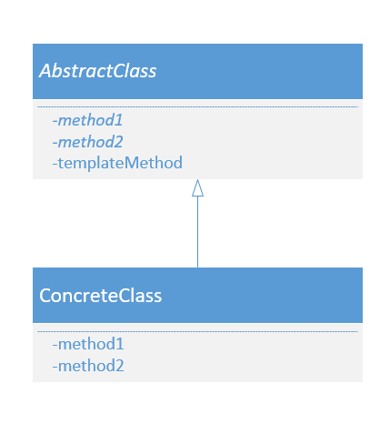

# 模板模式

## 概念

父类定义 (final) 模板方法(定义的是处理流程框架，决定具体处理的抽象方法如何调用)，同时定义具体处理的抽象方法，这些抽象方法由子类实现

要点：

1. 模板方法由子类实现，不同的子类实现不同，行为也就不一样
2. 父类负责模板方法的调用，整体的处理流程是父类决定的

总结：

- 在父类中定义处理流程的框架，在子类中实现具体处理的模式

- 在父类中编写模板方法的算法，子类无需要再编写

## 角色

### AbstractClass(抽象类)

- 需要实现模板方法
- 定义抽象方法（子类实现）

### ConcreteClass(具体类)

- 实现父类的抽象方法

## 示例

- JDK InputStream的子类